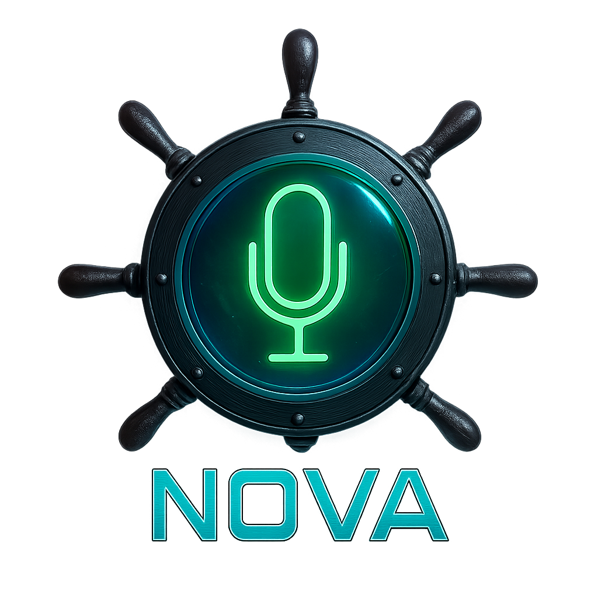

  

<h1 align="center">NOVA</h1>

<b>New Operational Voice Architecture</b>

Sovereign · Encrypted · Cloud‑Native

---

## 🚀  What is NOVA ?
NOVA is a **zero‑trust Push‑to‑Talk & data platform** engineered for governments, defence and critical infrastructure.  
Fully containerised, it drops on any Kubernetes cluster—edge, datacentre or air‑gapped cloud—within minutes.

| Key Outcome | What it means |
|-------------|---------------|
| 🛡️ **End‑to‑end secrecy** | Strong crypto (AES‑256 / ChaCha20) & mTLS everywhere |
| 📶 **Any network** | 4G/5G, sat‑link, LoRa mesh, or offline store‑and‑forward |
| 📊 **Instant visibility** | Grafana dashboards, Prometheus metrics, optional AI alerts |
| 🛰️ **Edge‑ready** | Runs the same on a single node or a hardened cluster |

---
